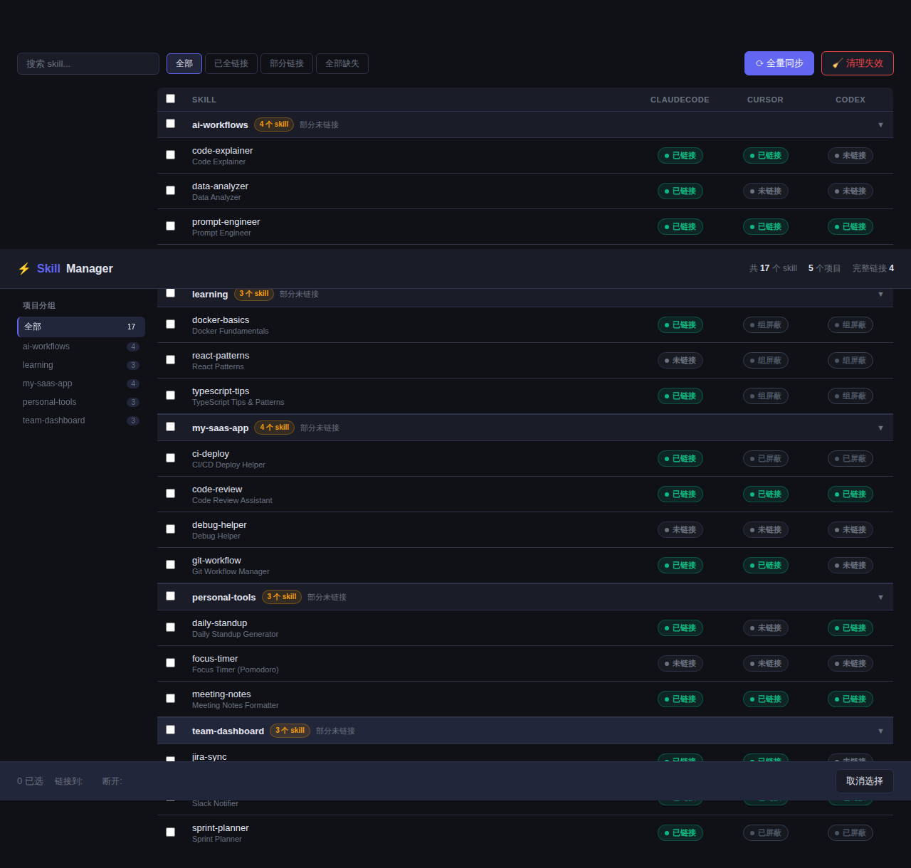
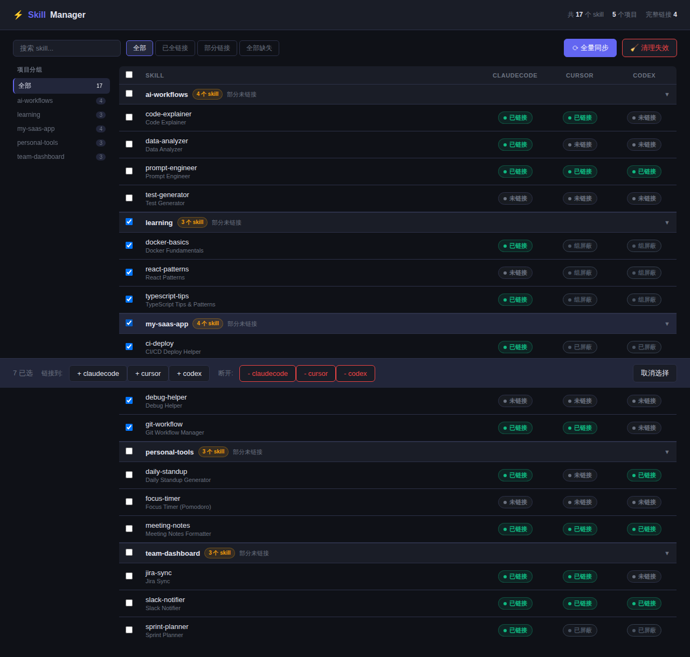
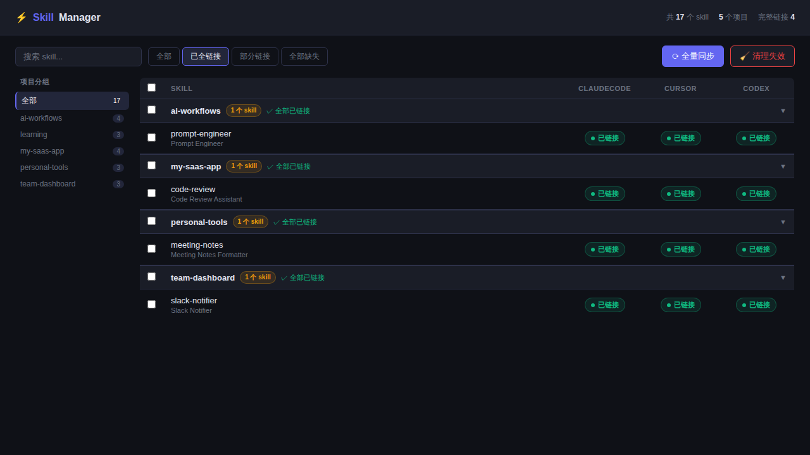
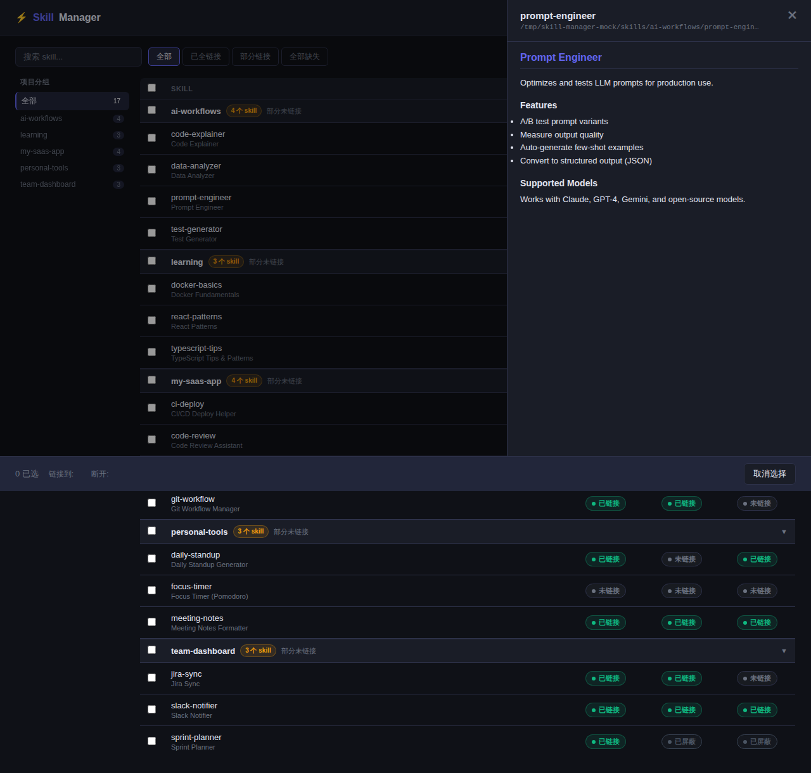

# ⚡ Skill Manager

> **[English](README.md)**

基于 Web 的 AI 编程工具 Skill 软链接管理面板。支持 Claude Code、Codex、Cursor、OpenClaw 以及任何通过目录加载 skill 的工具。



---

## 这是什么？

Claude Code 等 AI 编程工具通过扫描本地目录来加载 "skill"（slash 命令、agent、工作流）——目录中含有 `SKILL.md` 文件的子目录即为一个 skill。如果你同时使用多个 AI 工具，就需要为每个工具分别维护软链接，既繁琐又容易出错。

**Skill Manager** 解决了这个问题：它扫描你的 skill 仓库，直观展示每个 skill 在各工具中的链接状态，并让你在一个 UI 中统一管理所有软链接。

---

## 功能

### 总览面板
- 按项目/仓库分组展示所有 skill，分组可折叠
- 每个工具的链接状态：**已链接** · **未链接** · **已屏蔽** · **链接错误** · **实体目录**
- 页头统计：skill 总数、项目数、完整链接数
- 左侧边栏快速切换分组、过滤视图

### 链接管理
- **左键点击**状态标签切换链接/取消链接
- **右键点击**打开上下文菜单（屏蔽、解除屏蔽、修复链接等）
- **一键修复**指向错误路径的软链接
- **批量操作**：勾选多个 skill → 批量链接/断开任意工具



### 三级屏蔽规则
| 级别 | 作用范围 | 典型用途 |
|------|----------|----------|
| 工具规则 | 某工具的全部 skill | 临时禁用 Codex，不影响其他工具 |
| 分组规则 | 某项目组的全部 skill | 内部工具只允许链接到 Claude Code |
| Skill 规则 | 某个 skill 的某个工具 | 草稿 skill 只对指定工具开放 |

支持白名单例外：在全局屏蔽中为特定 skill 或整组开白名单。

### 快速筛选
按链接完整度过滤 skill 列表：



- **全部** — 显示所有 skill
- **已全链接** — 已链接到全部工具
- **部分链接** — 部分工具已链接，部分未链接
- **全部缺失** — 未链接到任何工具

### Skill 详情抽屉
点击任意 skill 名称，右侧弹出抽屉展示完整的 `SKILL.md` 内容，支持基本 Markdown 渲染。



### 全量同步 & 清理
- **全量同步** — 为所有未屏蔽的 skill 创建缺失的软链接，并报告名称冲突
- **清理失效** — 删除目标不存在的悬空软链接

### 删除
- **软删除** — 移除软链接并将 skill 从列表中隐藏（可恢复）
- **硬删除** — 同时删除 skill 的源目录
- 已删除的 skill 可在「已删除」面板中查看并一键恢复

### 其他
- **名称冲突检测** — 同名 skill 存在于多个目录时显示警告徽标
- **分组全选** — 点击分组标题行的 checkbox 可全选/取消该分组所有 skill
- **配置热更新** — 修改 `tools.json`（如通过 `npx skills add` 安装）后自动生效，无需重启

---

## 快速开始

```bash
git clone https://github.com/ryderme/skill-manager
cd skill-manager
npm install

# 复制并编辑配置文件
cp tools.example.json tools.json
# 编辑 tools.json，填入你的工具路径和 skill 目录

npm start
# 打开 http://localhost:3456
```

---

## 配置说明

所有配置集中在项目根目录的 `tools.json` 中。

```json
{
  "tools": {
    "claudecode": "~/.claude/skills",
    "codex":      "~/.codex/skills",
    "cursor":     "~/.cursor/skills"
  },
  "skillsDir": [
    "~/github",
    { "path": "~/.agents/skills", "group": ".agents" }
  ],
  "excludeProjects": ["skill-manager"],
  "rules": {
    "my-private-skill": { "exclude": ["codex"] }
  },
  "groupRules": {
    "internal-tools": { "only": ["claudecode"] }
  },
  "toolRules": {
    "codex": { "blockAll": true, "allow": ["my-approved-skill"] }
  },
  "deletedSkills": []
}
```

### `tools`
工具名 → 软链接目录的映射。

### `skillsDir`
要扫描的目录列表，每个条目可以是：
- 字符串路径（`"~/github"`）— 该目录的直接子目录名作为分组名
- 对象 `{ "path": "...", "group": "名称" }` — 该路径下所有 skill 使用指定的固定分组名

### `excludeProjects`
扫描时跳过的项目/目录名。

### `rules`
单个 skill 的屏蔽规则：
```json
"my-skill": { "exclude": ["tool1", "tool2"] }
```

### `groupRules`
整组的屏蔽规则：
```json
"my-group": { "only": ["claudecode"] }
"other-group": { "exclude": ["codex"] }
```

### `toolRules`
全局工具级规则，支持白名单例外：
```json
"codex": {
  "blockAll": true,
  "allow": ["skill-a"],
  "allowGroups": ["trusted-group"]
}
```

---

## 开发

```bash
npm run dev            # watch 模式（文件变更自动重启）
npm test               # 运行测试（77 个测试用例）
npm run test:coverage  # 带覆盖率报告
```

测试使用 Jest + supertest，针对真实 Express 应用和临时文件系统运行——没有数据库 mock。Husky pre-commit 钩子在每次提交前自动运行完整测试套件。

### 生成 mock 数据用于截图

```bash
node scripts/create-mock.js
# 然后在独立端口启动 mock 服务器：
_TEST_CONFIG_PATH="/tmp/skill-manager-mock/tools.json" PORT=3457 node server.js
```

---

## 代码结构

```
server.js          入口文件 — 启动 Express，默认端口 3456
app.js             Express 应用 — 所有 API 路由和配置热更新
lib/
  skillLogic.js    纯函数：isAllowed、getSkillGroup、findSkillDirs
public/
  index.html       单文件前端（原生 JS，无需构建）
tools.json         运行时配置（已 gitignore，用 tools.example.json 作模板）
```

### API 一览

| 方法 | 路径 | 说明 |
|------|------|------|
| GET | `/api/skills` | 获取所有 skill 及各工具链接状态 |
| GET | `/api/skills/:name/content` | 获取 SKILL.md 内容（详情抽屉） |
| POST | `/api/skills/:name/link` | 创建软链接 |
| DELETE | `/api/skills/:name/link` | 删除软链接 |
| DELETE | `/api/skills/:name` | 软/硬删除 skill |
| POST | `/api/skills/:name/restore` | 恢复软删除的 skill |
| PUT | `/api/skills/:name/rule` | 更新 skill 级规则 |
| PUT | `/api/groups/:group/rule` | 更新分组级规则 |
| PUT | `/api/tools/:tool/rule` | 更新工具级全局规则 |
| PUT | `/api/tools/:tool/allow` | 管理工具白名单 |
| POST | `/api/sync` | 全量同步 |
| POST | `/api/clean` | 清理失效软链接 |
| POST | `/api/batch/link` | 批量链接 |
| POST | `/api/batch/unlink` | 批量断开链接 |
| DELETE | `/api/groups/:group` | 删除分组下全部 skill |

---

## License

MIT
